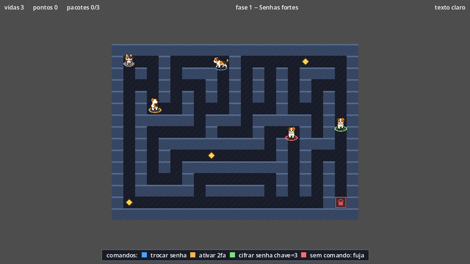
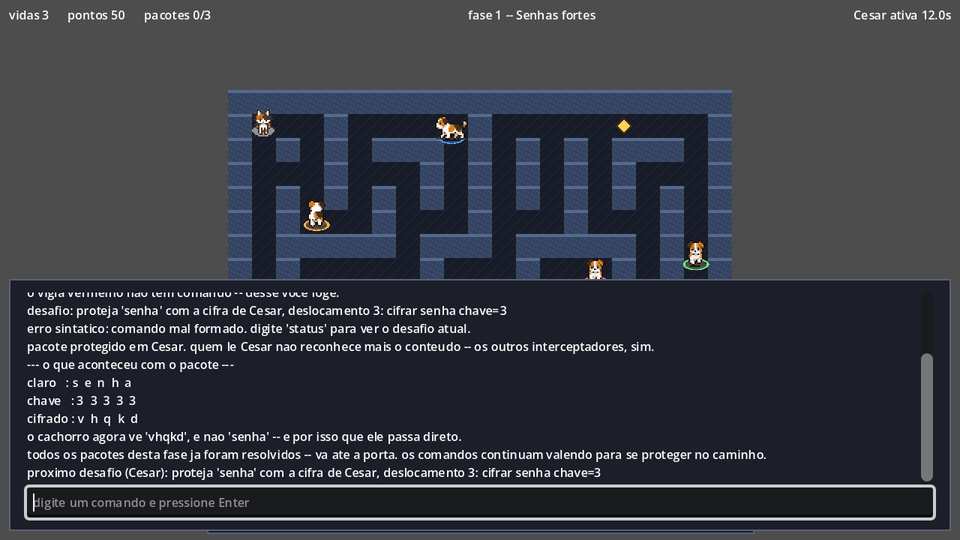
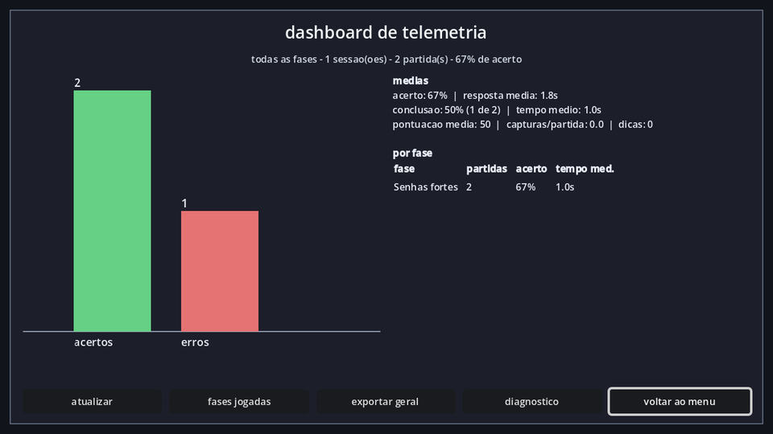

# Purr Bytes — cliente Godot

Jogo educacional 2D em pixel art para o ensino de **letramento digital, criptografia e
segurança cibernética**. Trabalho de Conclusão de Curso de Ciência da Computação da
Universidade Positivo (Curitiba, 2026), orientado pelo Prof. Me. Leandro Escobar.

Este repositório é o **cliente** (o jogo). O back-end de telemetria fica em
[`Morc3go/prototipo`](https://github.com/Morc3go/prototipo).



**Godot 4.4+** (testado em 4.6 e 4.7.2) · GDScript com tipagem estática · renderizador
Mobile · 640×360 · sem addons.

---

## O jogo

O labirinto é a **topologia de uma rede**, e o gato transporta um **pacote de dados** até
a porta de saída. No caminho há **vigias** (cachorros farejadores) que representam quem
intercepta dados em trânsito. Cada vigia tem um **anel colorido** no chão e é parado de um
jeito:

| Vigia | Como se proteger |
|---|---|
| **de cifra** (César, Vigenère ou SHA-256) | aplicar a cifra no terminal, por exemplo `cifrar senha chave=3`. O comando passa pelo analisador léxico e sintático, e a proteção vem da cifra de verdade |
| **de comando** | digitar a frase de conduta que o professor definiu, por exemplo `trocar senha` |
| **que só persegue** | não há comando: a defesa é fugir |

Encostar num vigia sem a proteção certa **intercepta o pacote**: o jogador perde uma vida
e pontos e volta ao início. Não é game over: é o custo pedagógico do erro. A tela de
captura explica o que teria protegido e congela a ação; `Enter` continua. Na volta, os
cachorros retornam aos pontos onde nasceram e o gato fica alguns segundos invulnerável,
piscando.

Espalhados pelo labirinto há **pacotes** com perguntas curtas. A porta só abre depois de
coletar todos.

| Tecla | Ação |
|---|---|
| `WASD` / setas | mover |
| `T` | abrir o terminal (pausa o jogo) |
| `F4` | painel que mostra como a cifra funciona, letra a letra |
| `F3` | desenha a rota que o A\* calculou para cada cachorro |
| `ESC` | menu de pause (continuar, reiniciar fase, voltar ao menu) |

**Comandos do terminal:** `cifrar <palavra> chave=<valor>`, `decifrar …`, `hash <palavra>`,
`verificar <palavra> <prefixo>`, `dica` e `status`, além dos comandos livres da fase.



---

## Criando fases (ferramenta de autoria)

O jogo não traz fases fixas: o professor as cria. Na primeira execução é criada uma
**fase de exemplo** ("Senhas fortes"), que já traz os três tipos de vigia.

**Menu → criar fase** abre o editor, em três abas:

- **geral**: título, briefing, vidas, tamanho do mapa e semente. A caixa *mostrar ao
  jogador o comando que para cada vigia* põe uma legenda no rodapé da fase. Desligue numa
  fase de avaliação, em que ver o comando entregaria a resposta.
- **cachorros**: cor e tipo de cada vigia. Comando livre pede o comando; cifra pede
  palavra e chave (SHA-256 não tem chave); "só persegue" não pede nada.
- **perguntas**: enunciado, opções, a correta e uma explicação opcional.

**Salvar** valida pelo mesmo caminho que o jogo usa: fase inválida não é gravada, e os
erros aparecem na tela. O labirinto é gerado a partir da semente e é **sempre
solucionável**. Em **escolher fase** dá para jogar, editar, exportar e excluir, e **subir
fase** importa um arquivo `.json`.

A fase é um JSON pequeno. O mapa viaja como semente, não desenhado:

```json
{
  "titulo": "Senhas fortes",
  "id_fase": "uuid-v4 (gerado se ausente; liga a fase à telemetria)",
  "briefing": "texto mostrado ao entrar",
  "mostrar_comandos": true,
  "vidas": 3,
  "mapa": {"largura": 21, "altura": 15, "seed": 20260914},
  "cachorros": [
    {"cor": "#4da3ff", "comando_para_bloquear": "trocar senha"},
    {"cor": "#7ee081", "modo_de_bloqueio": "CIFRA", "algoritmo_exigido": "CESAR",
     "palavra": "senha", "chave": "3"},
    {"cor": "#ff6b6b", "comando_para_bloquear": ""}
  ],
  "terminais": [
    {"enunciado": "qual destas é a senha mais difícil de descobrir?",
     "opcoes": ["uma frase longa", "seu nome e o ano"],
     "correta": "uma frase longa",
     "explicacao": "tamanho vale mais que símbolo."}
  ]
}
```

`algoritmo_exigido` aceita `CESAR` (chave de 1 a 25), `VIGENERE` (chave em letras) e
`SHA256` (sem chave; o jogador confere com `hash` e `verificar`). Comando vazio significa
que o vigia só persegue.

---

## Telemetria

A telemetria é **coleta de dados de pesquisa**, feita de forma anônima: o jogador é só um
UUID (`id_sujeito`), texto digitado é truncado em 240 caracteres, e nada de nome, e-mail
ou identificador de máquina sai do cliente. Os eventos são assíncronos, enfileirados em
disco e tolerantes a falha: se a API cair, o jogo continua e a fila espera.

**Menu → telemetria** abre o painel:

1. **visão geral**: acertos × erros e médias (acerto, tempo de resposta, conclusão,
   tempo de conclusão, pontuação, capturas e dicas) de todas as fases;
2. **fases jogadas**: uma linha por fase (`id_fase`). Selecione uma ou várias (ctrl/shift)
   para tirar a média só delas ou exportá-las;
3. **detalhe da fase**: a telemetria de uma fase e o histórico de partidas. Jogar a mesma
   fase de novo soma aqui.

Dá para exportar o geral, a seleção ou uma fase (com os registros crus) em JSON.



### Configuração da coleta

O jogo cria `user://config.cfg` na primeira execução:

```ini
[telemetria]
modo_telemetria="MOCK"        ; MOCK grava em disco; HTTP envia para a API
url_api="http://localhost:8080"
chave_api=""                  ; escopo INGESTAO (só escreve); nunca aparece na tela
tamanho_lote=50
intervalo_envio_s=5.0

[pesquisa]
id_sujeito=""                 ; UUID do participante, preenchido antes de cada coleta

[diagnostico]
nivel_log="INFO"              ; SILENCIO | ERRO | AVISO | INFO | DEPURACAO
```

Os dados do jogo ficam em `user://`. No Windows é
`%APPDATA%\Godot\app_userdata\Purr Bytes\`:

| Arquivo | Conteúdo |
|---|---|
| `fases/` | as fases criadas (`.json`) |
| `telemetria_mock.jsonl` | registro local da coleta (modo MOCK) |
| `historico_telemetria.jsonl` | cópia local do que o servidor aceitou (modo HTTP) |
| `fila_telemetria.json` | eventos ainda não enviados |
| `exportacoes/` | arquivos exportados pelo painel |

O contrato REST, com exemplos reais de cada corpo enviado, está em
[`docs/contrato-telemetria.md`](docs/contrato-telemetria.md).

---

## Rodando e testando

```powershell
# ajuste para onde o Godot estiver na sua máquina
$godot = "$env:LOCALAPPDATA\Programs\godot\Godot_v4.7.2-stable_win64.exe"

& $godot --path .                                   # abrir no editor
& $godot --headless --path . --import               # importar (depois de git pull)
& $godot --headless --path . --script res://tests/runner.gd            # suíte inteira
& $godot --headless --path . --script res://tests/runner.gd -- sprites # só um arquivo
```

A suíte é nativa, sem addon ([ADR 0005](docs/decisoes/0005-suite-de-testes-nativa.md)),
e sai com código 0 quando está verde. Ela inclui os casos TC-01 a TC-04 da monografia
(`tests/teste_casos_monografia.gd`). Os dois testes de HTTP sobem
`tools/servidor_eco.py`, então precisam de `python` no PATH. As fases e a telemetria que os
testes criam ficam em `user://testes`, nunca na lista de fases do jogador.

### Ferramentas

| Comando | Para quê |
|---|---|
| `tools/sessao_de_demonstracao.gd` | abre e encerra uma sessão MOCK e imprime o JSONL (gera os exemplos do contrato) |
| `tools/simular_queda.gd -- encher` / `-- drenar` | demonstra a resiliência: a fila sobrevive ao processo morto e drena sem perder nem duplicar evento |
| `python tools/servidor_eco.py 8091 log.jsonl` | servidor de eco das quatro rotas, para o modo HTTP sem back-end |
| `python tools/arte/extrair_gato.py`, `extrair_cachorro.py` | normalizam as folhas de sprite originais |
| `tools/gerar_sprite_frames.gd` | monta os `SpriteFrames` a partir das folhas |

Os scripts `.gd` rodam com `& $godot --headless --path . --script res://<caminho>`.

---

## Arquitetura

```
autoload/        ConfigJogo, Sessao, Telemetria (fila, lote, retentativa, MOCK/HTTP)
cenas/base/      fase_base (a cena de fase: toda a lógica), jogador, cachorro, terminal
cenas/ui/        menu, seleção de fases, editor, HUD, captura, painel de telemetria
scripts/dominio/ FaseConfig, MapaConfig, CachorroConfig, PacoteConfig, DesafioConfig (dados)
scripts/lexico/  AFD, parser recursivo descendente, AST, validação semântica
scripts/cripto/  César, Vigenère, SHA-256 (HashingContext)
scripts/ia/      navegação (AStarGrid2D), A* de referência (didático), Diretor
scripts/geracao/ gerador de labirinto e leitura/escrita da fase em JSON
tests/           suíte nativa
docs/            decisões (ADR), gramática, contrato de telemetria, conformidade
```

A fase é **dado**, não código: o JSON vira um `FaseConfig`, e `fase_base.tscn` é a única
cena de fase. Onde a engine já resolve, usamos a ferramenta nativa:

| Necessidade | Godot |
|---|---|
| Pathfinding | `AStarGrid2D` (com uma implementação didática comentada usada como oráculo nos testes, [ADR 0001](docs/decisoes/0001-astar.md)) |
| Mapa e colisão | `TileMapLayer` + `TileSet` com a custom data `solido`, que o A\* e a física leem |
| Personagens | `CharacterBody2D`, `AnimatedSprite2D` + `SpriteFrames` |
| SHA-256 | `HashingContext` |
| HTTP | `HTTPRequest` |
| Seleção múltipla, tabelas | `ItemList`, `RichTextLabel` com `[table]` |

## Relação com a monografia

| Monografia | No jogo |
|---|---|
| RF: comandos por interface de análise léxica | terminal com AFD → parser → semântica ([gramática](docs/gramatica.md)) |
| RF: rotas de pacotes e ameaças dinâmicas | labirinto gerado, cachorros com A\* |
| RF: tempo de resolução, acerto e erro | telemetria por resposta, por partida e por fase |
| RF: cifras e hashing como proteção, visualmente | vigias de cifra, explicação letra a letra, painel `F4` |
| RNF: pixel art, hardware escolar | sprites animados, renderizador Mobile, amostra de desempenho |
| RNF: REST/JSON assíncrono | fila em disco, lote, backoff com jitter |
| RNF: sem dado pessoal | só UUIDs; texto livre truncado |
| RNF: nova fase com baixo esforço | editor + JSON; nenhuma linha de código por fase |
| Quadro 1 (TC-01 a TC-04) | `tests/teste_casos_monografia.gd` |

O mapeamento completo, com os desvios a defender e as pendências para o TCC II, está em
[`docs/conformidade-monografia.md`](docs/conformidade-monografia.md). As decisões de
projeto, uma por arquivo, estão em [`docs/decisoes/`](docs/decisoes/).
